# cc-tmux



Prefer an interactive terminal recording? Install [asciinema](https://asciinema.org/) and run:

```bash
asciinema play assets/cc-tmux-demo.cast
```

You can also convert the cast to GIF/SVG with tools such as `agg` if you need an embeddable artifact.

`cc-tmux` is a dependency-light Python CLI for running [Claude Code](https://claude.ai/code) inside a tmux session and controlling it from another process. It is designed for developers and AI orchestrators that need a reliable, inspectable way to start Claude, send prompts, capture progress, and stop the session without scraping a fragile GUI.

## Why tmux Control Mode?

The core workflow is intentionally simple:

- Claude Code runs in a normal tmux pane inside your project directory.
- `cc-tmux` sends instructions with `tmux send-keys`.
- Humans and bots inspect state with `tmux capture-pane`.
- tmux remains the source of truth, so you can attach manually whenever automation gets confusing.

This is robust across SSH, local terminals, servers, Telegram/Slack bots, and multi-agent systems. It avoids shell injection by using `subprocess` argv lists for tmux calls and only quotes the Claude launch command at tmux's required single-command boundary.

## Requirements

- Python 3.10+
- tmux 3.x recommended
- Claude Code CLI available as `claude` on `PATH`

## Install

From a checkout:

```bash
git clone git@github.com:cycorld/cc-tmux.git
cd cc-tmux
python -m pip install -e .
```

For development:

```bash
python -m pip install -e '.[dev]'
pytest
```

## Quickstart

```bash
# Start Claude Code in a project. Session name is deterministic if omitted.
cc-tmux start ~/projects/my-app --prompt "Read the repo and summarize the test strategy."

# Send another instruction later.
cc-tmux send ~/projects/my-app "Implement the smallest safe fix and run tests."

# Interrupt a busy Claude Code turn, wait for the prompt, then send a follow-up.
cc-tmux interrupt ~/projects/my-app --wait-ready 10
cc-tmux send ~/projects/my-app "Revise the plan: only inspect files for now."

# See recent pane output plus prompt/plan-mode heuristics.
cc-tmux status ~/projects/my-app

# Ask Claude Code for a plan without implementing it.
cc-tmux start . --name planner --permission-mode plan --prompt "Plan X, do not implement"
cc-tmux send planner "/plan Create a step-by-step plan for X, but do not implement."
cc-tmux status planner --json

# Capture more transcript lines.
cc-tmux capture ~/projects/my-app -n 120

# Stop gracefully, falling back to kill if needed.
cc-tmux stop ~/projects/my-app --fallback-kill
```

## Command reference

### `cc-tmux start <project_path>`

Creates or reuses a tmux session running Claude Code in `project_path`.

Options:

- `--name NAME`: explicit tmux session name. Names are normalized with a `cc-tmux-` prefix.
- `--prompt TEXT`: prompt to send after startup.
- `--permission-mode MODE`: passed to Claude Code; defaults to `acceptEdits`.
- `--claude-arg ARG`: extra argument for Claude Code. Repeat for multiple args.
- `--auto-trust` / `--no-auto-trust`: send `Enter` after startup for workspace trust prompts. Default: enabled.

Example:

```bash
cc-tmux start . --name api-fix --permission-mode acceptEdits --claude-arg --model --claude-arg sonnet
```

### `cc-tmux send <session_or_project> "prompt"`

Sends text plus `Enter` to the Claude pane.

```bash
cc-tmux send api-fix "Run pytest and fix failures."
```

If Claude is actively working, interrupt first and wait until the input prompt is visible before sending a follow-up. Live testing showed `Escape` interrupts an active Claude Code task; sending the next prompt too early can append it to the prior input line. `interrupt` clears any stale input with `C-u` and waits a short settle period by default before returning.

```bash
cc-tmux interrupt api-fix --wait-ready 10
cc-tmux send api-fix "Stop the current approach and summarize what changed so far."
```

### `cc-tmux key <session_or_project> <KEY...>`

Sends one or more tmux key names directly to the Claude pane using tmux argv, not a shell. Use this for TUI controls such as closing overlays, accepting prompts, or moving history.

Examples:

```bash
cc-tmux key api-fix Escape
cc-tmux key api-fix Up Enter
cc-tmux key api-fix C-c
```

### `cc-tmux interrupt <session_or_project>`

Convenience wrapper around `key` for interrupting a busy Claude Code turn. Default key: `Escape`.

Options:

- `--key KEY`: tmux key name to send instead of `Escape`, for example `C-c`.
- `--wait-ready SECONDS`: after sending the key, poll `status` until `last_prompt_ready` is true or the timeout expires.
- `--clear-input` / `--no-clear-input`: send `C-u` after interruption/readiness to clear stale input. Default: enabled.
- `--settle SECONDS`: short delay after cleanup before returning, so immediate follow-up sends do not lose their first character. Default: 0.3.

Recommended follow-up workflow:

```bash
cc-tmux interrupt api-fix --wait-ready 10
cc-tmux send api-fix "New instruction after interruption."
```

### `cc-tmux status <session_or_project> [--json]`

Reports whether the tmux session exists, whether the pane appears ready for a prompt, plan-mode state, and the latest capture snippet. JSON output includes both `done` (kept for compatibility) and `last_prompt_ready` for the prompt-ready heuristic, plus:

- `plan_mode`: true when the capture looks like Claude Code plan mode (`plan mode on`, `Enabled plan mode`, or the plan approval screen).
- `awaiting_plan_approval`: true when Claude is showing the `Ready to code?` / `Would you like to proceed?` approval prompt.
- `plan_file`: a visible `~/.claude/plans/<name>.md` path, or null.

```bash
cc-tmux status . --json
```

### Plan mode workflow

Use Claude Code plan mode when you want an implementation plan without edits yet. Live testing confirmed both `--permission-mode plan` and `/plan ...` leave the filesystem unchanged until approval.

```bash
cc-tmux start . --name planner --permission-mode plan --prompt "Plan X, do not implement"
cc-tmux send planner "/plan Create a step-by-step plan for X, but do not implement."
cc-tmux status planner --json
```

When the approval screen is visible, `status --json` should report `plan_mode: true`, `awaiting_plan_approval: true`, and may expose `plan_file` such as `~/.claude/plans/fluffy-wibbling-oasis.md`. The screen's default option is typically `1. Yes, auto-accept edits`; if that is selected and you intentionally want to proceed, approve with:

```bash
cc-tmux key planner Enter
```

To request plan changes, select option `4` or send feedback carefully. Avoid sending free-form follow-up text blindly while the approval UI is focused; inspect `cc-tmux capture planner -n 120` first so you know which option is selected and whether your text will be interpreted as approval feedback.

### `cc-tmux capture <session_or_project>`

Prints captured pane output.

Options:

- `-n, --lines N`: number of recent lines, default 80.
- `--ansi` / `--no-ansi`: include or strip ANSI escapes. Default: no ANSI.

### `cc-tmux list [--json]`

Lists known sessions from `~/.local/state/cc-tmux/sessions.json` plus live tmux sessions with the `cc-tmux-` prefix.

### `cc-tmux stop <session_or_project>`

Sends `/exit` to Claude Code.

Options:

- `--kill`: immediately kill the tmux session.
- `--fallback-kill`: send `/exit`, wait, then kill if still live.
- `--wait SECONDS`: wait duration for graceful exit. Default: 3.

### `cc-tmux trust <session_or_project>`

Sends `Enter`, useful for accepting Claude Code's workspace trust prompt.

### `cc-tmux demo`

Creates a temporary workspace, starts Claude Code, asks it to create `CONTROL_MODE_RESULT.md`, polls for that file until `--wait`, and prints status plus `result_file_exists`, `result_file`, and a short preview when available. This requires live `tmux` and `claude`.

```bash
cc-tmux demo --wait 10
```

## State file

`cc-tmux` stores optional resolution metadata at:

```text
~/.local/state/cc-tmux/sessions.json
```

It maps project paths and session names to session records. tmux remains authoritative; deleting the state file is safe.

## Safety model

- Core tmux invocations use `subprocess.run([...], shell=False)`.
- Session names are normalized to safe tmux-friendly names.
- `cc-tmux key` and `cc-tmux interrupt` pass tmux key names as argv entries to `tmux send-keys`; they do not evaluate shell text.
- `--permission-mode acceptEdits` is the practical default for automation but still delegates edit behavior to Claude Code.
- `cc-tmux stop` is graceful by default. Use `--kill` only when you intentionally want to terminate tmux.
- Prompts are sent literally as tmux key strings. Avoid sending secrets unless you trust the tmux host and scrollback.

## Claude Code slash-command notes

Live testing confirmed these Claude Code slash commands work inside a `cc-tmux`-controlled pane:

- `/help`: displays Claude Code's command surface and currently includes `/btw`.
- `/btw <question>`: asks a side question without derailing the main task. Example: `/btw What is 2+2? answer in one short sentence.` returned `2+2 equals 4.` The side-question overlay shows controls such as `Esc to close`; close it with `cc-tmux key SESSION Escape` before continuing automation.
- `/loop`: loads the loop skill and asks for prompt/interval details. It may start durable or autonomous repeated actions, so use it only intentionally. When testing or dismissing overlays, send `cc-tmux key SESSION Escape`.
- `/plan <request>`: enables plan mode and asks Claude for a plan before implementation. Inspect with `cc-tmux status SESSION --json`; approve only intentionally with `cc-tmux key SESSION Enter` when the desired option is selected, or choose `4`/feedback to revise.

Slash command prompts are still just text sent to Claude Code, for example:

```bash
cc-tmux send api-fix "/btw Is the current task blocked? Answer briefly."
```

## Troubleshooting

- `tmux binary not found`: install tmux and ensure it is on `PATH`.
- `claude binary not found`: install Claude Code and verify `claude --version` works in the same shell.
- Workspace trust prompt blocks progress: run `cc-tmux trust <session>` or use the default `--auto-trust` behavior.
- Need to interrupt a busy turn: run `cc-tmux interrupt <session> --wait-ready 10`, confirm `last_prompt_ready: true`, then use `cc-tmux send` for the follow-up. The interrupt command clears stale input and settles briefly by default to avoid dropping the first follow-up character. If readiness times out, inspect with `cc-tmux capture <session> -n 120` before sending more text.
- Overlay or slash-command panel stuck open: run `cc-tmux key <session> Escape`.
- Status says `exists: false`: check `tmux list-sessions` and `cc-tmux list --json`.
- ANSI-heavy output: prefer `cc-tmux capture --no-ansi`; control-mode streams can be noisy.
- Need manual recovery: `tmux attach -t cc-tmux-your-session`.

## Examples for chat/agent orchestration

### Hermes / Telegram bot

```bash
cc-tmux start /srv/repos/app --name app-worker --prompt "Inspect the latest failure."
cc-tmux status app-worker --json
cc-tmux send app-worker "Apply the fix and summarize changed files."
```

Return `cc-tmux capture app-worker -n 80` to the chat surface when the user asks for progress.

### Slack worker

A Slack command handler can resolve the channel to a stable session name:

```bash
cc-tmux start /srv/repos/app --name slack-C123456
cc-tmux send slack-C123456 "$SLACK_TEXT"
```

### Generic multi-agent supervisor

```bash
SESSION=$(cc-tmux start "$PROJECT" --prompt "$TASK" | awk '/session:/ {print $3}')
cc-tmux status "$SESSION" --json
```

If you need fully structured output, call `cc-tmux list --json` and `cc-tmux status --json` from your agent runtime.

## Battle-tested scenarios

Local battle testing covered:

- Initial `start --prompt` creating a file in a project.
- Follow-up `send` creating a second file.
- Resolution by project path, `list`, and `capture --no-ansi`.
- Graceful `stop` with fallback kill.
- Clean failure for invalid project paths.
- End-to-end `demo` against live `tmux` and `claude`.

## Development

```bash
python -m pip install -e '.[dev]'
ruff check .
pytest
```

CI runs Ruff and pytest on Python 3.10, 3.11, and 3.12.

## License

MIT
